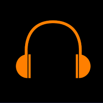
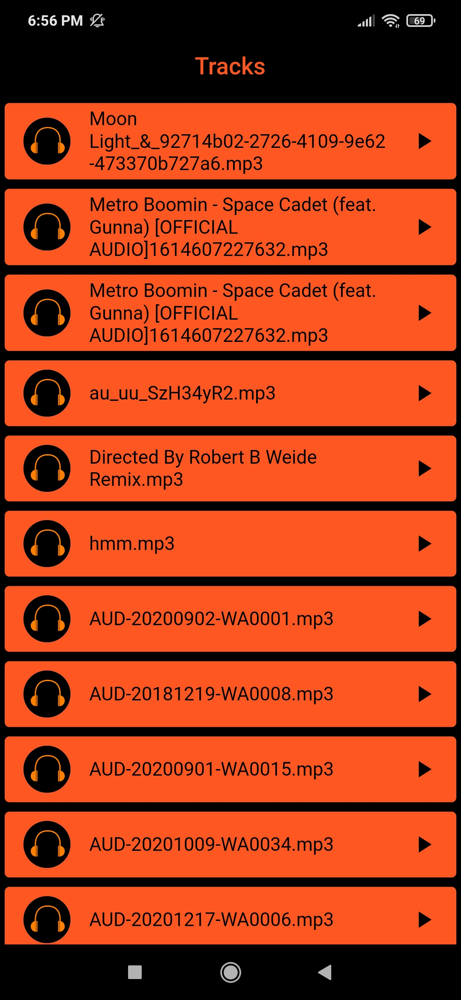
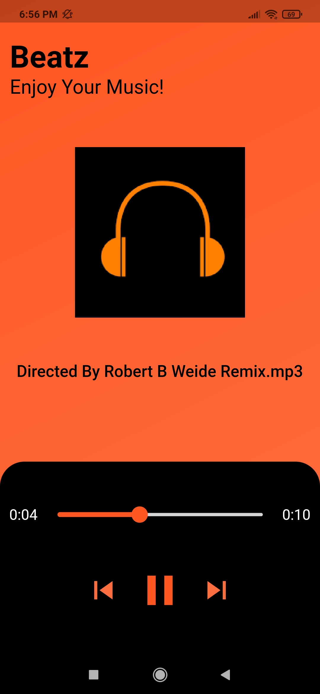

# Beatz
Music app  

  

  
A cross-platform app that extracts all the .mp3 files in the device and becomes the super audio app.

## Packages used:
audioplayers: ^0.18.3  
path: ^1.8.0  
path_provider: ^2.0.1  
flutter_file_manager: ^0.2.0  
path_provider_ex: ^1.0.1

## Screenshots
      

## Getting Started

This project is a starting point for a Flutter application.

A few resources to get you started if this is your first Flutter project:

- [Lab: Write your first Flutter app](https://flutter.dev/docs/get-started/codelab)
- [Cookbook: Useful Flutter samples](https://flutter.dev/docs/cookbook)

For help getting started with Flutter, view our
[online documentation](https://flutter.dev/docs), which offers tutorials,
samples, guidance on mobile development, and a full API reference.
